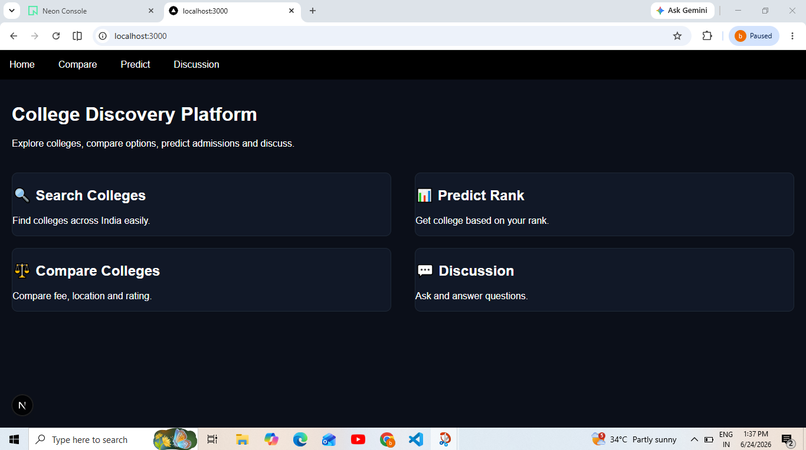
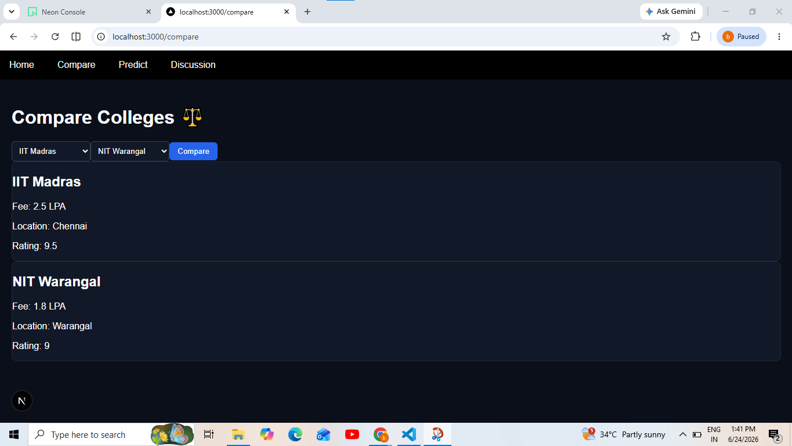
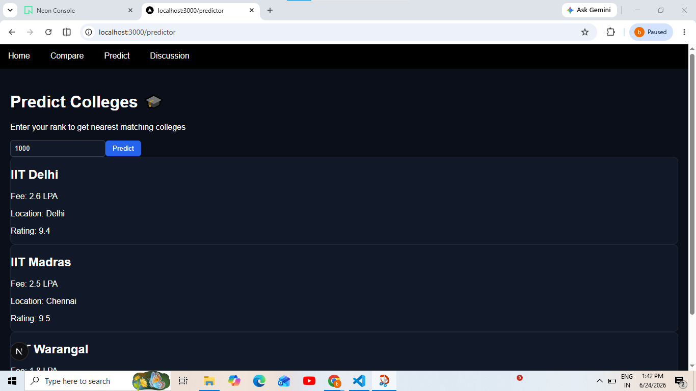
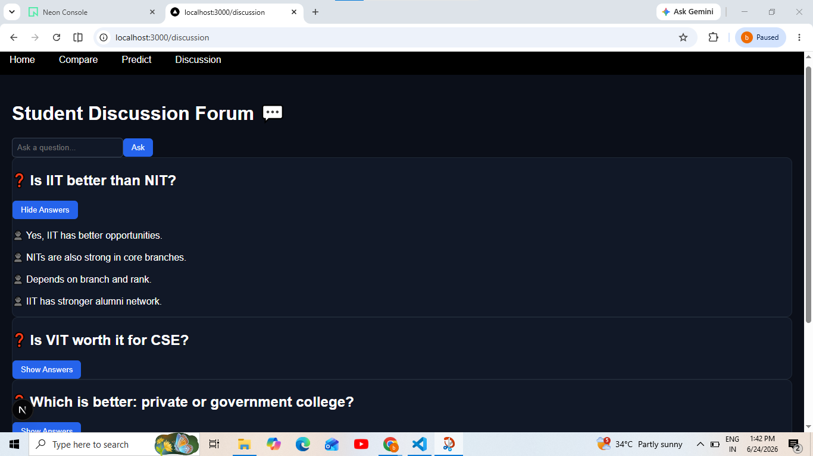

# 🎓 College Discovery Platform

A modern web application that helps students explore, compare, predict, and discuss colleges in one place. The platform provides an intuitive interface for college comparison, rank-based prediction, and student-driven discussions.

## 🌐 Live Demo

https://college-discovery-platform-seven-amber.vercel.app/

## 📂 GitHub Repository

https://github.com/chramyasudha11/college-discovery-platform

---

## 📖 Overview

Choosing the right college can be challenging for students. The College Discovery Platform simplifies this process by offering tools to:

* Explore colleges and their details
* Compare colleges side by side
* Predict suitable colleges based on rank
* Participate in student discussions and Q&A

The project is built using Next.js and provides a clean, responsive, and user-friendly experience.

---

## ✨ Features

### 🏠 Home Dashboard

* Modern landing page
* Quick navigation to all platform features
* Informative feature cards

### ⚖️ College Comparison

* Select two colleges from dropdown menus
* Compare colleges side by side
* View:

  * Fees
  * Location
  * Ratings

### 📊 College Prediction

* Rank-based college prediction
* Smart nearest-match recommendation logic
* Displays the most relevant colleges for a given rank

### 💬 Student Discussion Forum

* Browse common student questions
* View multiple student-style answers
* Add new questions dynamically
* Interactive show/hide answers functionality

---

## 🛠️ Tech Stack

### Frontend

* Next.js
* React
* TypeScript

### Styling

* CSS
* Responsive UI Design

### Deployment

* Vercel

### Version Control

* Git
* GitHub

---

## 📁 Project Structure

```text
college-discovery-platform/
│
├── app/
│   ├── compare/
│   │   └── page.tsx
│   ├── predict/
│   │   └── page.tsx
│   ├── discussion/
│   │   └── page.tsx
│   ├── data/
│   │   └── colleges.ts
│   ├── globals.css
│   ├── layout.tsx
│   └── page.tsx
│
├── components/
│   └── Navbar.tsx
│
├── public/
├── package.json
└── README.md
```

---

## 🚀 Getting Started

### Clone the Repository

```bash
git clone https://github.com/chramyasudha11/college-discovery-platform.git
```

### Navigate to Project Directory

```bash
cd college-discovery-platform
```

### Install Dependencies

```bash
npm install
```

### Start Development Server

```bash
npm run dev
```

### Open in Browser

```text
http://localhost:3000
```

---

## 📸 Screenshots

### 🏠 Home Page


### ⚖️ Compare Page


### 📊 Predict Page


### 💬 Discussion Page


---

## 🎯 Future Enhancements

* College search and filtering
* State-wise college recommendations
* Branch-specific prediction system
* User authentication
* Real-time discussion forum
* Database integration
* AI-powered college recommendations
* Bookmark favorite colleges
* Advanced analytics and insights

---

## 💡 Learning Outcomes

Through this project, I gained practical experience in:

* Building applications with Next.js
* Component-based UI development
* State management using React Hooks
* Dynamic rendering and conditional UI
* Responsive web design
* Git and GitHub workflows
* Deploying applications with Vercel

---

## 👩‍💻 Author

**Ramya Sudha**

Aspiring Software Engineer passionate about building impactful web applications and continuously learning modern technologies.

GitHub: https://github.com/chramyasudha11

---

## ⭐ Support

If you found this project useful, consider giving it a star on GitHub.

⭐ Star the repository to support the project and future improvements.
